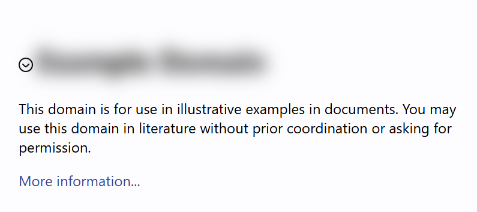

# Haven

Haven helps hide and filter unwanted content, creating a safer, distraction-free, and more comfortable internet.

## Features

### Smart Content Filtering

- Automatically hides harmful, distracting, negative, triggering, or unwanted words, phrases, and related terms, providing a peaceful browsing experience.

### International Language Support

- Supports non-space-separated languages like Chinese, Japanese, and Korean, ensuring global accessibility.

### Sync Across Devices

- Preferences sync seamlessly across devices for a consistent experience.

### Privacy by design

- No personal data is collected, ensuring your browsing remains private and secure.

## Who Is Haven For?

Haven is designed for anyone looking to improve their browsing experience.

### Mental health support: 
Individuals recovering from Post-traumatic stress disorder (PTSD), trauma-related conditions, phobias, panic attacks, addiction, anxiety, or other mental health issues, who need a space free from trigger terms and content.

### Wellness-Focused and mindful browsing:
People seeking a more positive online experience, free from harmful, negative, triggering, sensitive or distressing content such as news, politics, violence, and misinformation/disinformation from social media platforms/forums* and news sites.

###### * Support Twitter, X, Facebook, Instagram, Threads, Reddit, LinkedIn, Snapchat, TikTok, Pinterest, YouTube, Discord, Tumblr, Clubhouse, etc.

### Distraction Control: 
People who wish to hide distracting items, minimize distractions, and enhance productivity by blocking harmful or distracting content.

## Get started

### Installation

1. Download the latest [release](https://github.com/arcadia-io/haven/releases/latest) and unzip the file.
2. Open `chrome://extensions/` page (or go to Chrome > `More Tools` > `Extensions`).
3. Enable **Developer mode** in the upper-right corner.
4. Click **Load unpacked** and select the extracted folder.

For a step-by-step guide with images, see the [official Chrome extension installation guide](https://developer.chrome.com/docs/extensions/get-started/tutorial/hello-world#load-unpacked).

### Usage

Click the Haven icon in the Chrome toolbar.

#### Hide keywords and phrases
1. Enter the word or phrase.
2. Press **Enter**.

#### Remove keywords and phrases from the blocklist
1. Enter the word or phrase.
2. Click **Undo**.

#### Remove the **last** keywords and phrases
1. Click **Undo**.

## Keywords: 

Content Blocker, Content Filter, Custom Filter, Custom Filtering, Personalized Browsing Control, Internet Filter, Internet Filtering, Internet Blocker, Internet Safety
